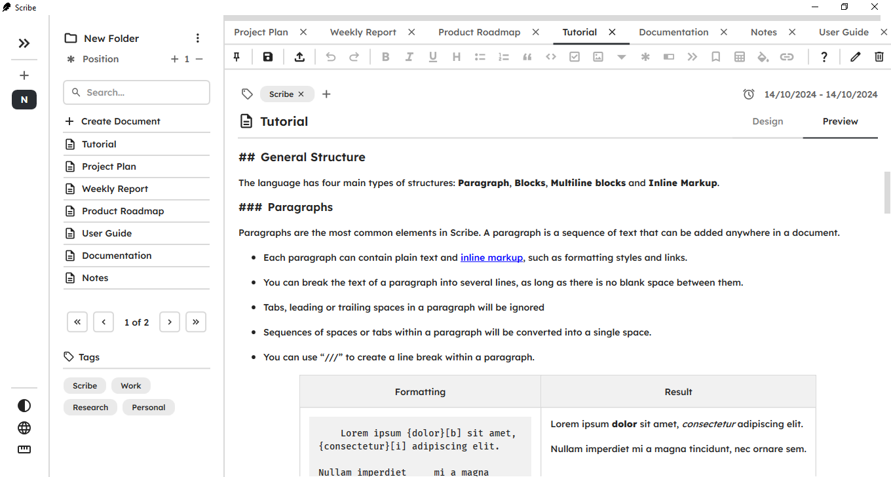

<h1 align="center">
    
</h1>

* [About](#-scribe)
* [Installation](#installation)
* [Building](#building)
* [Tech Stack](#tech-stack)
* [Features](#features)
* [Showcase](#showcase)
* [License](#license)


# 🪶 Scribe

Scribe is a desktop application built with C# using WPF and .NET 8. It enables users to create and edit documents using a custom markup language, with complete rendering of the formatted text.

A detailed tutorial for Scribe's markup language is available at [Tutorial.pdf](https://github.com/enzzoMs/Scribe/blob/main/Tutorial.pdf).

# Installation

Requirements:
* [.NET 8 SDK](https://dotnet.microsoft.com/pt-br/download)
* Windows 10/11

You can download the application from the [GitHub releases page](https://github.com/enzzoMs/Scribe/releases).

After downloading, run the `Scribe.exe` file. Ensure that the executable is always located in the same directory as the `Configurations` and `Database` folders.

# Building

Requirements:
* [.NET 8 SDK](https://dotnet.microsoft.com/pt-br/download)
* Windows 10/11

To build the project from the source code, clone this repository to your local environment or download the project files:


```
git clone https://github.com/enzzoMs/Scribe.git
```

Navigate to the main project directory:

```
cd ./Scribe/Scribe.UI
```

Run the following command to publish the application:

```
dotnet publish -r win-x64 -o <OUTPUT_DIRECTORY>
```

The resulting files will be placed in the specified directory (<OUTPUT_DIRECTORY>), ready to run as described in the [previous section](#installation).


# Tech Stack

* [C#](https://dotnet.microsoft.com/languages/csharp) + [.NET 8](https://dotnet.microsoft.com/pt-br/)

* [WPF](https://learn.microsoft.com/en-us/dotnet/desktop/wpf/overview/?view=netdesktop-8.0) + [MVVM Architecture](https://en.wikipedia.org/wiki/Model-view-viewmodel)

* [EF Core](https://learn.microsoft.com/en-us/ef/core/) + [SQLite](https://sqlite.org/)

* [xUnit](https://xunit.net/) + [NSubstitute](https://nsubstitute.github.io/)

Additional Libraries:

* [AvalonEdit](https://github.com/icsharpcode/AvalonEdit) - A WPF-based text editor component.

* [PDFsharp](https://www.pdfsharp.net/) - An open source library for creating and processing PDF documents. 

# Features 

- **Folders and Documents**: Create and organize documents into folders for easier access and management.

- **Tags**: Mark related content with tags to simplify searching and categorization.

- **Markup Language**: Utilize a custom markup language for formatting documents with headers, lists, tables, bold, italics, and more.

- **Save and Load Documents**: Save and load documents in JSON format for easy storage and retrieval.

- **PDF Export**: Export rendered documents as PDF files.

- **Light and Dark Themes**: Toggle between light and dark modes for improved visibility.

## Showcase

<p align="center">
    
</p>

<p align="center">
    
</p>


# License

This project is distributed under the MIT License. Check the [LICENSE](https://github.com/enzzoMs/HexEmoji/blob/main/LICENSE) file for more details.
